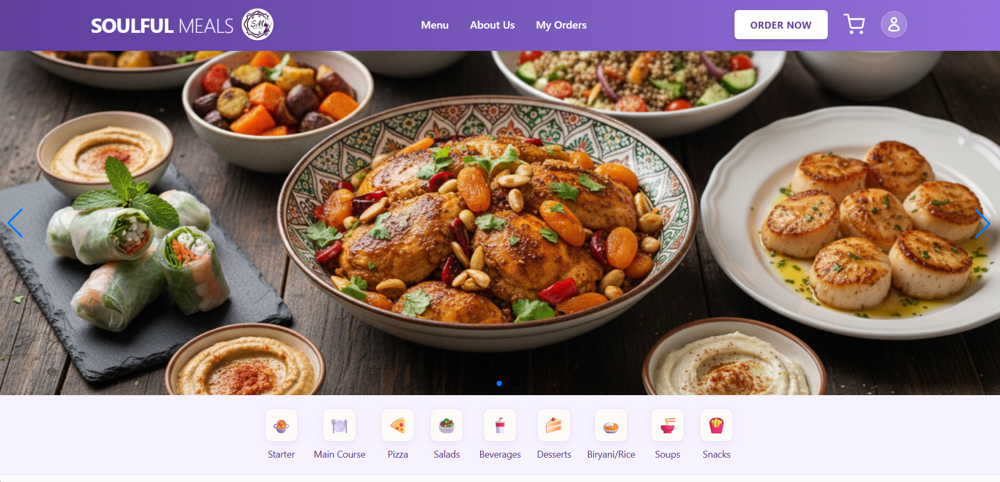
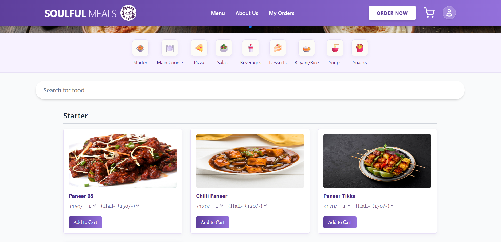
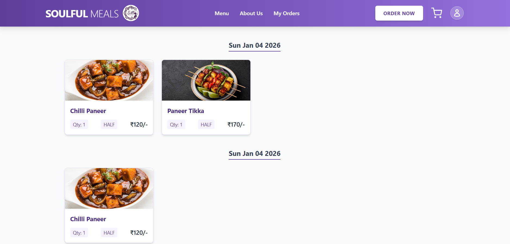
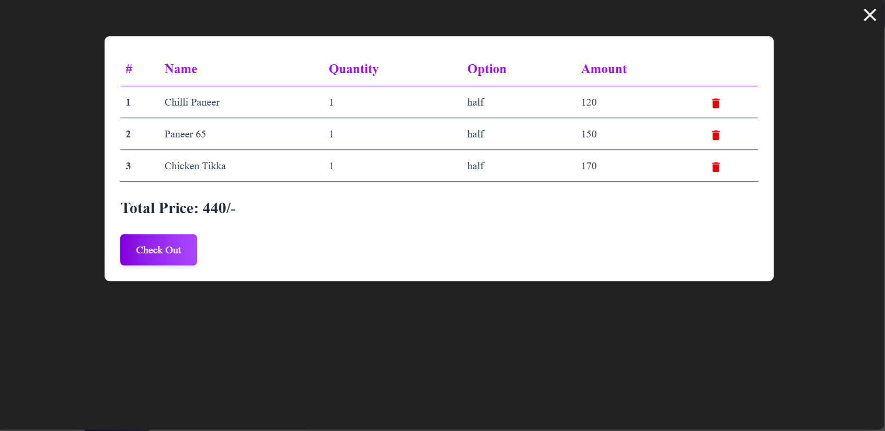

# Soulful Meals – Dockerized MERN Stack Food Ordering Web App

A responsive full-stack food ordering application built using the MERN stack, modernized with Tailwind CSS v4, Vite, and an optimized backend architecture.

---

## Description

Soulful Meals is a web-based food ordering platform designed to deliver a smooth and intuitive user experience.

**Purpose:**  
Allow users to browse food items by category, manage a personal cart, and securely place orders.

**Target Audience:**  
Users looking for a fast, responsive interface to order meals and track order history.

---

## Features

### Authentication
- Secure user signup and login
- JWT-based authentication
- Password hashing using bcryptjs

### Cart System
- Global cart state using Context API and `useReducer`
- Add, update, and remove items
- Dynamic price calculation based on size and quantity

### Ordering
- Place new food orders
- View complete order history

### Food Menu
- Dynamic food categories
- Built-in search for quick filtering

### Responsive Design
- Mobile-first layout
- Custom navigation menus
- CORS support for local network testing

---

## Tech Stack

### Frontend
- React (Vite)
- Tailwind CSS v4
- React Router DOM
- Context API + useReducer
- Swiper.js (Hero slider)
- Material UI Icons

### Backend
- Node.js
- Express.js
- MongoDB with Mongoose
- JWT Authentication
- bcryptjs
- express-validator, Joi
- Cloudinary (image management)
- Multer (file uploads)
- cookie-parser

### DevOps
- Docker
- Docker Compose
---

## Folder Structure
```text
root/
├── client/ # React frontend (Vite + Tailwind)
└── server/ # Node.js / Express backend (API & database
```
---
## Database Setup (MongoDB Atlas)
This project uses static seed data located in `server/data`.

### Step 1: Create a MongoDB Atlas Cluster
- Visit: https://www.mongodb.com/cloud/atlas
- Create a **Free Tier** cluster

### Step 2: Initialize Database

Create a database:

Create these collections:
```bash
| Collection Name | Source File |
|-----------------|------------|
| food_items      | server/data/FoodData.json |
| food_category   | server/data/DataCategory.json |

Import the JSON files using MongoDB Compass or Atlas UI.
```
### Step 3: Get Connection String
Example:
```bash
mongodb+srv://<user>:<password>@cluster.mongodb.net/soulful_meals
```
---

## Installation & Setup (Dockerized)

### Clone the repository
```bash
git clone https://github.com/Anugrah71/Food_website
cd Food_website
```
### Environment Variables

Create a `.env` file inside the client/ directory:
```env
VITE_BACKEND_URL= http://localhost:500 you backend host url
```
Create a `.env` file inside the server/ directory:
```env
ACCESS_TOKEN_PRIVATE_KEY=YOUR_LONG_RANDOM_STRING_FOR_ACCESS
REFRESH_TOKEN_PRIVATE_KEY=YOUR_EVEN_LONGER_RANDOM_STRING_FOR_REFRESH

NODE_ENV=production
PORT=5000

MONGODB_URI=your_mongodb_connection_string

CLOUDINARY_CLOUD_NAME=your_cloud_name
CLOUDINARY_API_KEY=your_api_key
CLOUDINARY_API_SECRET=your_api_secret00
```
Root (.env) – Used by Docker Compose
```env
MONGODB_URI=your_mongodb_connection_string
```
### Run the Project
Build and start all services:

```bash
docker-compose up --build
```
## Access the App
Frontend 
```bash 
http://localhost:5173
```
Backend
```bash
http://localhost:5000
```
### Stop containers
```bash
docker-compose down
```
---
## API Endpoints
### Authentication & User

- `POST /api/createuser` : Used for user registration
- `POST /api/loginuser` : Used for user authentication
- `POST /api/refresh` : Used for refreshing authentication tokens

### Food & Orders
- `POST /api/foodData` : Used for fetching food items and categories
- `POST /api/orderData` : Used for submitting a new order
- `POST /api/myorderData` : Used for retrieving a user’s order history
Admin
- `GET /api/admin` : Used for admin-specific data access
---
## Screenshots / Demo
- Live Demo : https://food-website-1-ck7j.onrender.com

<p align="center">
  
  
</p>

<p align="center">
  
  
</p
---
## Future Improvements
- Role-based access control for admin dashboard
- Online payment integration (Stripe / Razorpay)
- Real-time order status tracking

## Future Improvements

- Role-based access control for admin dashboard
- Online payment integration (Stripe / Razorpay)
- Real-time order status tracking


